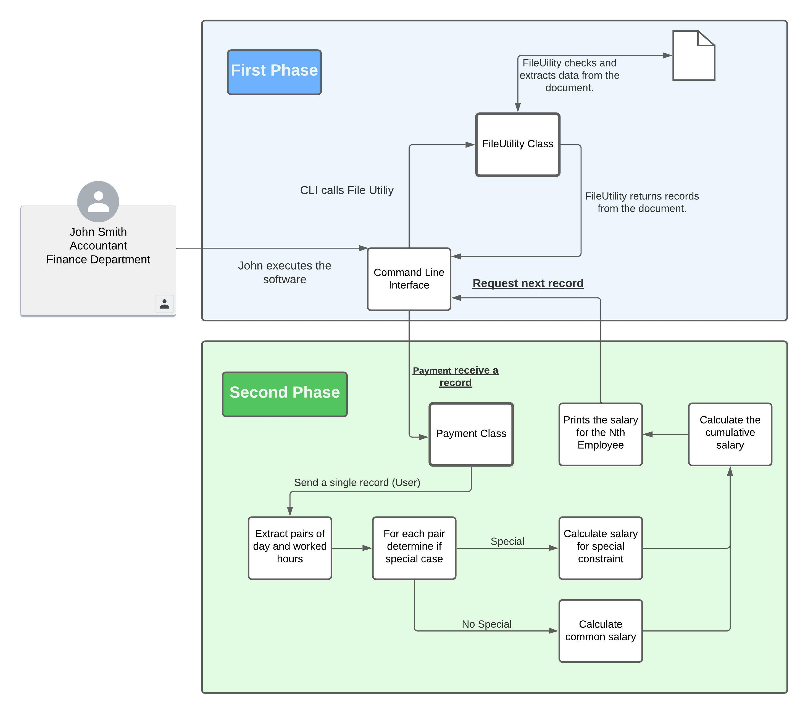

# IOET ACME Exercise

## Quickstart

### Usage

> `Python 3.10 required`

#### 1. Clone GitHub repository:
```
git clone https://github.com/leoAlvTor/IOETExercise.git
```

#### 2. Get into the project folder:
```
cd IOETExercise
```
#### 3. Run the console app:
```
python main.py
```

#### 4. Run test cases:
- Test case for FileUtility Class.
```
python -m unittest test_cases/file_utility_test_cases.py -v
```
- Test case for Payment Class.
```
python -m unittest test_cases/payment_test_cases.py -v
```

### Solution Overview:
The company ACME offers their employees the flexibility to work the hours they want. They will pay for the hours worked
based on the day of the week and time of day, according to the following table:

| Monday - Friday | Payment | Saturday - Sunday | Payment |
|-----------------|---------|-------------------|---------|
| 00:01 - 09:00   | 25 USD  | 00:01 - 09:00     | 30 USD  |
| 09:01 - 18:00   | 15 USD  | 09:01 - 18:00     | 20 USD  |
| 18:01 - 00:00   | 20 USD  | 18:01 - 00:00     | 25 USD  |

The goal of this exercise is to calculate the total that the company has to pay an employee, based on the hours they
worked and the times during which they worked. The following abbreviations will be used for entering data:

| Weekday   | Abbreviation |
|-----------|--------------|
| Monday    | MO           |
| Tuesday   | TU           |
| Wednesday | WE           |
| Thursday  | TH           |
| Friday    | FR           |
| Saturday  | SA           |
| Sunday    | SU           |

Input: the name of an employee and the schedule they worked, indicating the time and hours. This should be a .txt file
with at least five sets of data. You can include the data from our two examples below.

Output: indicate how much the employee has to be paid

#### Example:

| CASE   | INPUT                                                                      | OUTPUT                               |
|--------|----------------------------------------------------------------------------|--------------------------------------|
| CASE 1 | RENE=MO10:00-12:00,TU10:00-12:00,TH01:00-03:00,SA14:00-18:00,SU20:00-21:00 | The amount to pay RENE is: 215 USD   |
| CASE 2 | ASTRID=MO10:00-12:00,TH12:00-14:00,SU20:00-21:00                           | The amount to pay ASTRID is: 85 USD  |
| CASE 3 | MIGUEL=FR08:00-21:00                                                       | The amount to pay MIGUEL is: 220 USD |


### Architecture Explanation:

The next picture shows how is defined the architecture.




### Approach and Methodology:

#### Approach:
```
1. Understand the statement.
2. Get the requirements and the software limitations.
3. Design the solution.
4. Set up environment.
5. Implement the designed solution.
6. Check if the implemented solution is working as expected.
   1. Check for existing examples (Please refer to Case 1 and Case 2).
   2. Create new examples.
   3. Check for new examples.
   4. Create special cases examples.
   5. Verify special cases.
      1. What if the initial hour is in day A and end hour is in day B?
      2. What if the initial hour is greater or equal than end hour?
   6. Set up constraints in the design to meet new requirements (special cases).
7. Design and implement test cases.
8. Refactor the code for keeping it clean and KISS.
9. Write the README file.
```

#### Methodology:
```
Due the simplicity of the implemented solution I decided to use Waterfall methodology because it has a clear structure, 
and fast develivery for well defined constraints.
```